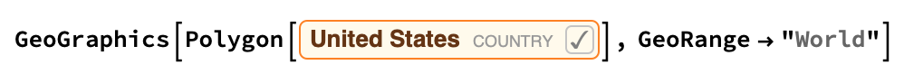
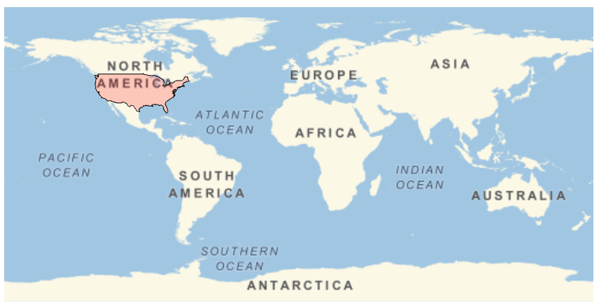

## Highlighting a Country

Once you have a map with a NightHemisphere highlighted, it's time to highlight a country. In this example, we're going to highlight the United States, but you can choose any country. Make sure that the country you choose is large enough to be seen clearly on the map.


--- task ---
Press `[Control] + [=]` to access a Freeform Input box directly within your code, where you can type the name of a country or city.



Highlight the United States on the map, using the Freeform Input box to type United States.

```
GeoGraphics[Polygon[United States], GeoRange -> "World"]
```


--- /task ---

Just having the grey highlight on the map isn't very clear. Changing the colour of the polygon would help it stand out more.

--- task ---
Change the colour of the highlighted country to red using `FaceForm`, and add black edges using `EdgeForm`.

```
GeoGraphics[{EdgeForm[Black], FaceForm[Red], Polygon[United States]}, 
 GeoRange -> "World"]
 ```


--- /task ---
