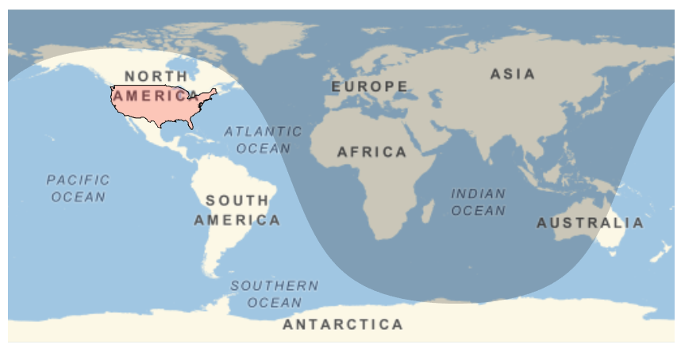
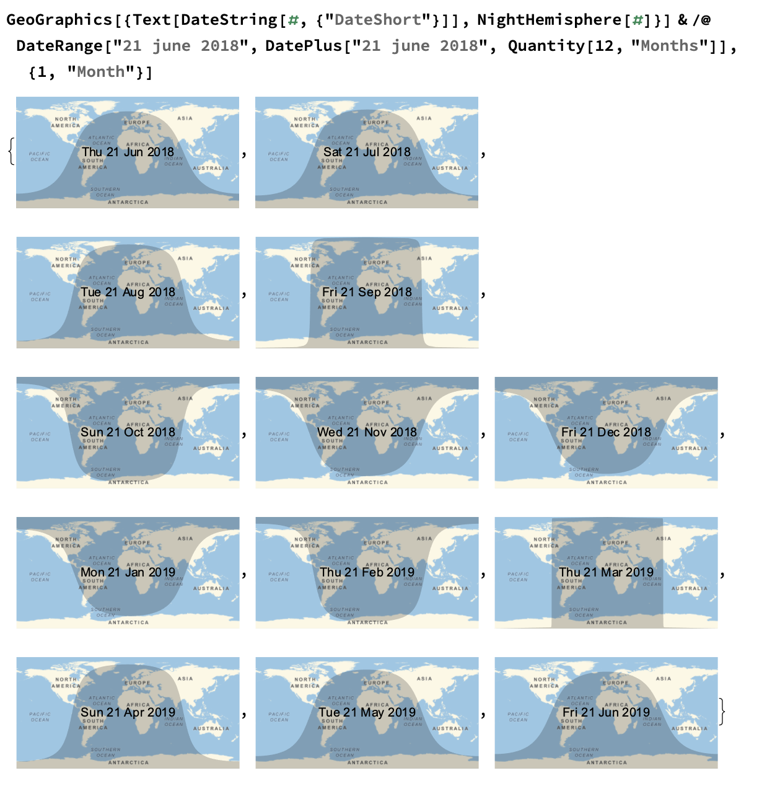

## Combine features

So far, you know how to add two features to a map: the night hemisphere and a highlighted country. Now combine the two features on one map.



--- task --- 

Add this code to combine the two features on one map function.

```
GeoGraphics[
 {
  NightHemisphere[],
  EdgeForm[Black],
  FaceForm[Red],
  Polygon[United States]
  },
 GeoRange -> "World"]
 
 ```
 --- /task --- 
 
Notice that `NightHemisphere` and `Polygon` are in a list using `{}`.

When different features are in one list, Wolfram treat them as one entity. This means that the `GeoGraphics` function can do lots of things at the same time.

--- collapse ---
---
title: Day and night hemispheres
---

Interestingly, the line indicating the night hemisphere looks different depending on the time of year, even though the shape of the night line doesn't change through the year. This is because the night line falls differently on this projection of the map, which causes some distortion. On a globe, the line would be straight all the way around. You can see below how the line is different each month through the year.



  
--- /collapse ---
