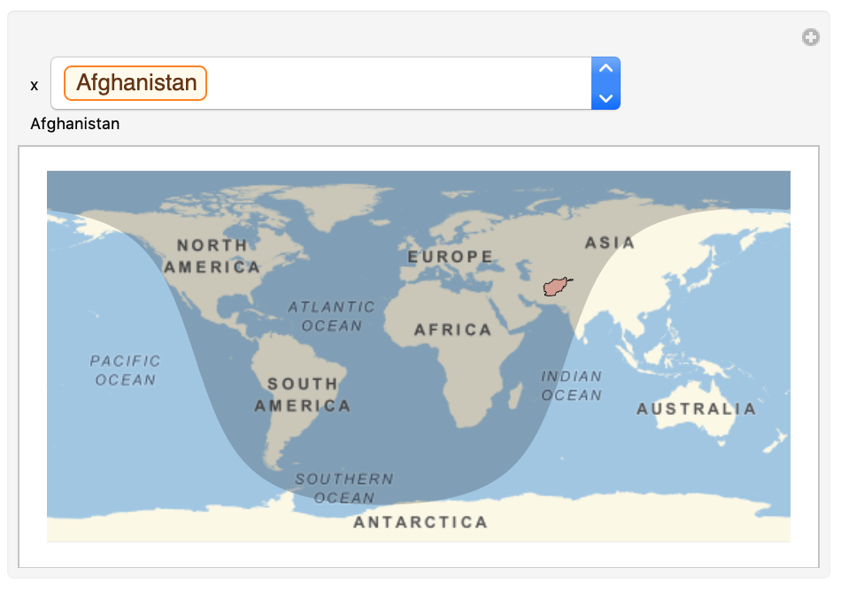
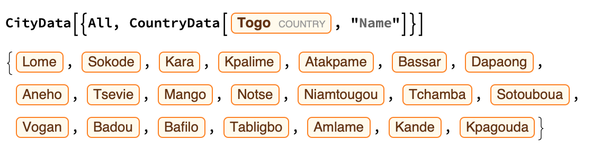
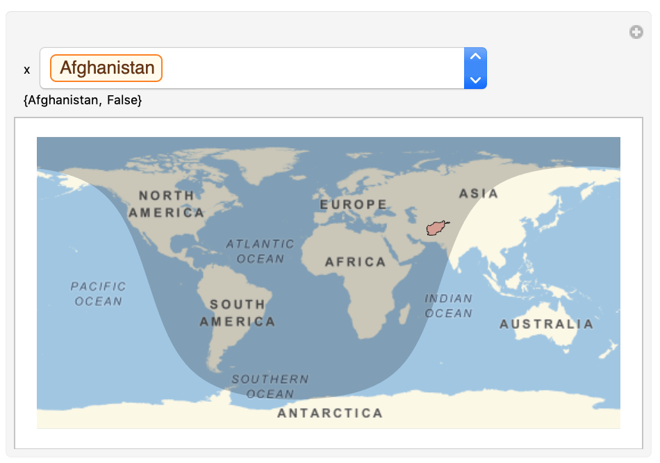

## Adding Information to Your Map

In this step, you're going to add a `Dynamic` sentence to your map, so that when the user selects a country, a sentence appears above the map, telling them information about that country.

`Dynamic` allows us to use whatever value the placeholder that `Manipulate` is representing.

--- task ---
First, make a `Dynamic` sentence which displays the name of the country when you select one from the drop down menu.

```
 Manipulate[
 GeoGraphics[
  {NightHemisphere[],
   {EdgeForm[Black],
    FaceForm[Red],
    Polygon[x]}
   },
  GeoRange -> "World"],
 {x, CountryData[]},
 Dynamic[CountryData[x, "Name"]]
 ]
 ```



Select a different country from the drop down menu, and check that the `Dynamic` name changes.

--- /task ---

Now that we've added a `Dynamic` object to our `Manipulate` function, we can start to make it more useful. How about a sentence which tells us if the highlighted country is in daytime or nighttime?

For this, we can use the function `DaylightQ`. `DaylightQ` asks the system if it's daylight or not, and outputs either `True` or `False`.

`DaylightQ` requires us to use a city, rather than a country.

You can find all the cities in a country using `CityData`

```
CityData[{All, CountryData[Entity["Country", "Togo"], "Name"]}]

```


And, because the cities are listed in size order, you can find the largest city in a country by simply taking the `First` item in the `CityData` list.

```
First[CityData[{All, CountryData[Entity["Country", "Togo"], "Name"]}]]

```

--- task ---
Change the `Dynamic` from just saying the name of the country, to also saying `True` if the largest city in the highlighted country is in daytime right now, and `False` if it is in nighttime.

Remember how we used a List, with `{}`, to ask `GeoGraphics` to do multiple things at the same time? We can do the same with `Dynamic`.

You can replace code from the previous task with this new code.

```
Manipulate[
 GeoGraphics[
 {NightHemisphere[],
 {EdgeForm[Black],
 FaceForm[Red],
 Polygon[x]}},
 GeoRange -> "World"],
 {x, CountryData[]}, 
 Dynamic[
 {CountryData[x, "Name"],
 DaylightQ[First[CityData[{All, CountryData[x, "Name"]}], 1]]}]
 ]
 ```
 
 
 
--- /task ---