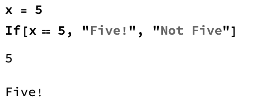
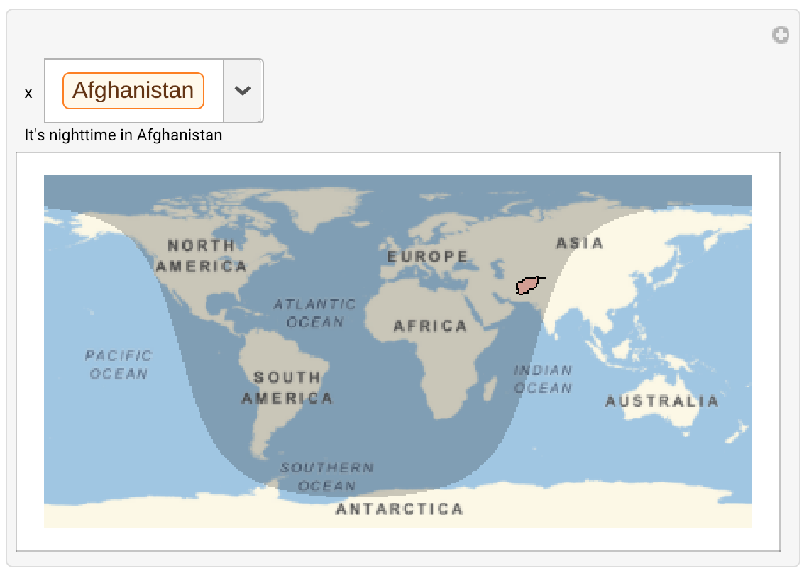

## Completing your Map

We made it a little easier for people to get information from our map by adding a `Dynamic` sentence at the top of the `Manipulate` which tells us the name of the country, and if it's currently Day or Night. But at the moment, we only say 'True' or 'False'. It would be better to have the sentence say 'It's Daytime' or 'It's Nighttime' instead.

In order to do this, we need an `If` statement.

The first thing in the `If` statement is the test. The test will render `True` or `False`. The second item in the `If` statement is what the code will return if the test is `True`, and the third is what the statement will return if the test is `False`

 

--- task ---
Build an `If` statement which displays 'It's Daytime in "Country Name"' if `DaylightQ` is True, and 'It's Nighttime in "Country Name"' if `DaylightQ` is False.

Use `Row` to improve the readability of your sentence by removing `{}` and `,` from your list.

You can replace code from the previous task with your new code.

 ```
Manipulate[
 GeoGraphics[{
 NightHemisphere[],
 EdgeForm[Black],
 FaceForm[Red],
 Polygon[x]},
 GeoRange -> "World"],
 {x, CountryData[]}, 
 Dynamic[
 If[DaylightQ[First[CityData[{All, CountryData[x, "Name"]}], 1]],
 Row[{"It's daytime in ", CountryData[x, "Name"]}],
 Row[{"It's nighttime in ", CountryData[x, "Name"]}]]]
 ]
 ```


--- /task ---

Now that we have an `If` Statement, we can add in some more information. It would be interesting to know, if it's daytime, when sunset will be, and if it's night time, when sunrise will be. We can find this information using the `Sunset[]` and `Sunrise[]` functions, and then taking the `TimeObject[]` of each of those functions. You need to use a city in the `Sunset[]` and `Sunrise[]` functions.

--- task ---

Extend your `If` statement to include what time the sunset will be if it's daytime, and what time the sunrise will be if it's nighttime.

Add text introducing the `TimeObject`.

You can replace code from the previous task with your new code.

```
Manipulate[
 GeoGraphics[
 {NightHemisphere[],
 EdgeForm[Black],
 FaceForm[Red],
 Polygon[x]},
 GeoRange -> "World"],
 {x, CountryData[]}, 
 Dynamic[
 If[DaylightQ[First[CityData[{All, CountryData[x, "Name"]}], 1]],
 Row[{
 "It's daytime in ",
 CountryData[x, "Name"],
 ". Sunset will be at: ",
 TimeObject[Sunset[First[CityData[{All, CountryData[x, "Name"]}], 1]]]
 }],
 Row[{"It's nighttime in ",
 CountryData[x, "Name"],
 ". Sunrise will be at: ",
 TimeObject[Sunrise[First[CityData[{All, CountryData[x, "Name"]}], 1]]]
 }]
 ]]
 ]
 ```


Your code might take a few seconds to run, it's doing a lot!

--- /task ---
