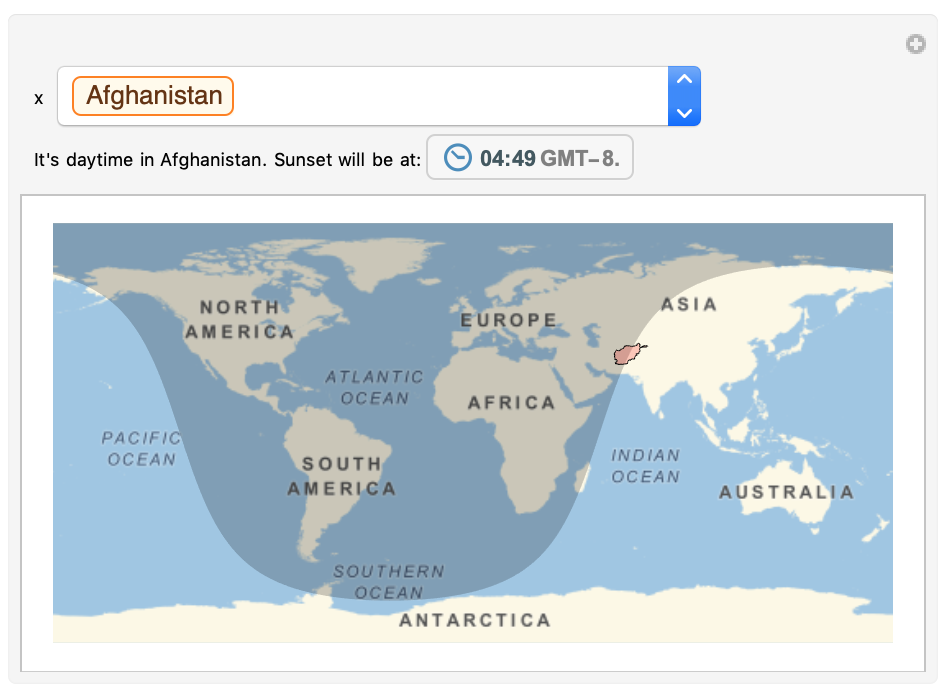

## Complete your map

At the moment, the `Dynamic` sentence at the top of the `Manipulate` function only says 'True' or 'False' to indicate whether it's day or night in the chosen place. It would be better to have the sentence say 'It's daytime' or 'It's nighttime' instead.

In order to do this, you need to add an `If` statement.

The first thing in the `If` statement is the test. The test returns `True` or `False`. The second item in the `If` statement is what the code returns if the test is `True`. The third item is what the statement returns if the test is `False`.

 

--- task ---
Build an `If` statement which displays 'It's daytime in "Country Name"' if `DaylightQ` is `True`, and 'It's nighttime in "Country Name"' if `DaylightQ` is `False`.

Use `Row` to make the displayed sentence easier to read by removing `{}` and `,` from your list.

You can replace the code you already have with this new code.

 ```
Manipulate[
 GeoGraphics[{
 NightHemisphere[],
 EdgeForm[Black],
 FaceForm[Red],
 Polygon[x]},
 GeoRange -> "World"],
 {x, CountryData[]}, 
 Dynamic[
 If[DaylightQ[First[CityData[{All, CountryData[x, "Name"]}], 1]],
 Row[{"It's daytime in ", CountryData[x, "Name"]}],
 Row[{"It's nighttime in ", CountryData[x, "Name"]}]]]
 ]
 ```


--- /task ---

Now that you have an `If` statement, you can add in more information. It would be interesting to know:
1. If it's daytime, when sunset will be
1. If it's night time, when sunrise will be

To get this information, use the `Sunset[]` and `Sunrise[]` functions, and take the `TimeObject[]` of each of these functions. You need to use a city in the `Sunset[]` and `Sunrise[]` functions.

--- task ---

Extend your `If` statement to include what time the sunset will be if it's daytime, and what time the sunrise will be if it's nighttime.

Add text introducing the `TimeObject`.

You can replace the code you already have with this new code.

```
Manipulate[
 GeoGraphics[
 {NightHemisphere[],
 EdgeForm[Black],
 FaceForm[Red],
 Polygon[x]},
 GeoRange -> "World"],
 {x, CountryData[]}, 
 Dynamic[
 If[DaylightQ[First[CityData[{All, CountryData[x, "Name"]}], 1]],
 Row[{
 "It's daytime in ",
 CountryData[x, "Name"],
 ". Sunset will be at: ",
 TimeObject[Sunset[First[CityData[{All, CountryData[x, "Name"]}], 1]]]
 }],
 Row[{"It's nighttime in ",
 CountryData[x, "Name"],
 ". Sunrise will be at: ",
 TimeObject[Sunrise[First[CityData[{All, CountryData[x, "Name"]}], 1]]]
 }]
 ]]
 ]
 ```


Your code might take a few seconds to run, because it's doing a lot of things!

--- /task ---
